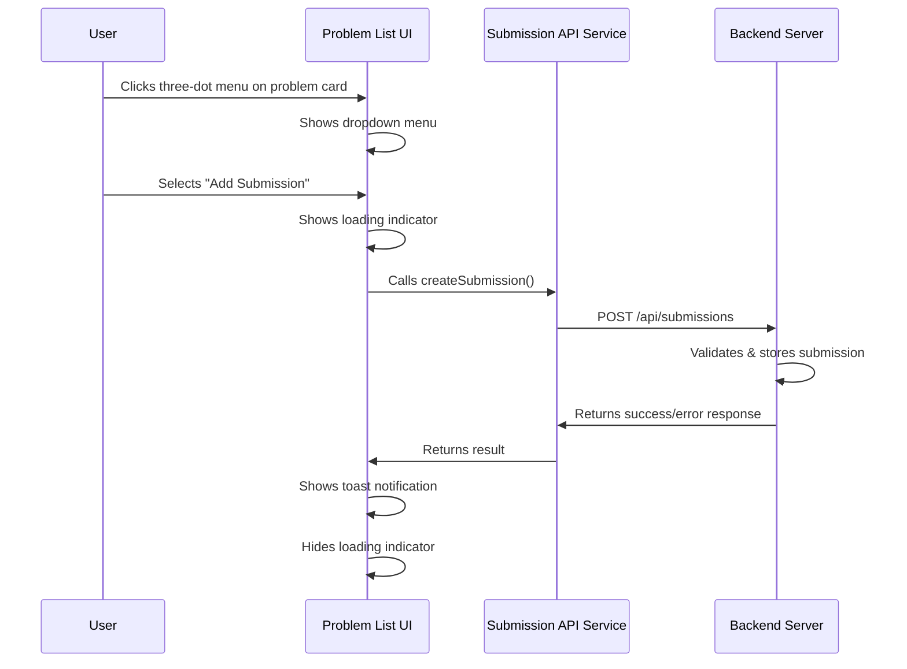

# Add Submission Button Implementation Plan

## Overview

This plan outlines the approach to implement an "Add Submission" button on the problem cards in the React Native frontend, allowing users to record their completed problems.

## Current Architecture

Based on the codebase analysis:

1. The frontend displays problem cards in `client/app/(tabs)/problems.tsx`
2. The backend has submission functionality implemented in:
   - `server/api/handlers/submission.go` - HTTP request handlers
   - `server/models/submission.go` - Data model and database operations
3. The backend API expects a POST request to `/api/submissions` with the following parameters:
   ```json
   {
     "is_internal": true,
     "leetcode_submission_id": "", // Optional if is_internal is true
     "user_id": 1,
     "title": "Problem Title",
     "title_slug": "problem-slug",
     "submitted_at": "2023-01-01T00:00:00Z"
   }
   ```

## Implementation Steps

### 1. Create a Submissions API Service

Create a new file at `client/app/services/api/submissions.ts` for handling API interactions:

```typescript
// submissions.ts
export interface SubmissionRequest {
  is_internal: boolean;
  leetcode_submission_id?: string;
  user_id: number;
  title: string;
  title_slug: string;
  submitted_at: string;
}

export interface SubmissionResponse {
  id: string;
  user_id: number;
  title: string;
  title_slug: string;
  submitted_at: string;
  created_at: string;
}

export const createSubmission = async (submission: SubmissionRequest): Promise<SubmissionResponse> => {
  try {
    console.log("Creating submission:", submission);
    
    const url = 'http://localhost:8080/api/submissions';
    console.log("Posting to URL:", url);
    
    const response = await fetch(url, {
      method: 'POST',
      headers: {
        'Content-Type': 'application/json',
      },
      body: JSON.stringify(submission),
    });
    
    if (!response.ok) {
      throw new Error(`API request failed with status ${response.status}`);
    }
    
    const data = await response.json();
    console.log("Submission created successfully:", data);
    return data;
  } catch (error) {
    console.error('Error creating submission:', error);
    throw error;
  }
};
```

### 2. Install Required Dependencies

We'll need to install two packages:
- `react-native-popup-menu` for the dropdown menu
- `react-native-toast-message` for toast notifications

Installation command:
```bash
npm install react-native-popup-menu react-native-toast-message
```

### 3. Modify Problem Cards in problems.tsx

Update the problem cards to include a three-dot menu icon and implement a dropdown menu:

```tsx
// Add imports at the top
import { Menu, MenuTrigger, MenuOptions, MenuOption } from 'react-native-popup-menu';
import { MenuProvider } from 'react-native-popup-menu';
import Toast from 'react-native-toast-message';
import { createSubmission } from '../services/api/submissions';

// In the component
// Add state for tracking submission loading
const [submittingProblemId, setSubmittingProblemId] = useState<number | null>(null);

// Add a function to handle submission
const handleAddSubmission = async (problem: Problem) => {
  setSubmittingProblemId(problem.id);
  try {
    await createSubmission({
      is_internal: true,
      user_id: 1, // Placeholder user ID
      title: problem.title,
      title_slug: problem.title_slug,
      submitted_at: new Date().toISOString(),
    });
    
    Toast.show({
      type: 'success',
      text1: 'Submission Added',
      text2: `Successfully recorded submission for "${problem.title}"`,
    });
  } catch (error) {
    Toast.show({
      type: 'error',
      text1: 'Error',
      text2: 'Failed to add submission',
    });
  } finally {
    setSubmittingProblemId(null);
  }
};
```

### 4. Update the FlatList renderItem Function

Modify the renderItem function to include the three-dot menu:

```jsx
<FlatList
  data={problems}
  maintainVisibleContentPosition={{ minIndexForVisible: 0 }}
  keyExtractor={(item, index) => `${item.id}-${item.frontend_id}-${index}`}
  renderItem={({ item }) => (
    <View className="flex gap-4 bg-[#131C24] px-4 py-3">
      <View className="flex flex-row gap-4 items-center">
        <TouchableOpacity 
          className="flex-1"
          onPress={() => handleProblemPress(item)}
        >
          <View className="flex flex-row gap-4">
            <View className="text-[#F8F9FB] flex items-center justify-center rounded-lg bg-[#29374C] shrink-0 size-12">
              {item.completed ? (
                <Ionicons name="checkmark-circle-outline" size={24} color="#4CD137" />
              ) : (
                <Ionicons name="checkmark-circle-outline" size={24} color="#FFFFFF" />
              )}
            </View>
            <View className="flex flex-1 flex-col justify-center">
              <Text 
                className="text-[#F8F9FB] text-base font-medium leading-normal"
                style={{ fontFamily: 'Roboto_500Medium' }}
              >
                {item.title}
              </Text>
              <Text 
                style={{ 
                  fontFamily: 'Roboto_400Regular',
                  fontSize: 14,
                  lineHeight: 20,
                  color: difficultyColors[item.difficulty] || '#8A9DC0'
                }}
              >
                {item.difficulty}
              </Text>
            </View>
          </View>
        </TouchableOpacity>
        
        {/* Three-dot menu */}
        <Menu>
          <MenuTrigger>
            <View className="p-2 flex items-center justify-center">
              {submittingProblemId === item.id ? (
                <ActivityIndicator size="small" color="#6366F1" />
              ) : (
                <Ionicons name="ellipsis-vertical" size={20} color="#8A9DC0" />
              )}
            </View>
          </MenuTrigger>
          <MenuOptions>
            <MenuOption onSelect={() => handleAddSubmission(item)}>
              <Text style={{ padding: 10, fontSize: 14 }}>Add Submission</Text>
            </MenuOption>
          </MenuOptions>
        </Menu>
      </View>
    </View>
  )}
  {/* Other FlatList props remain the same */}
/>
```

### 5. Wrap the Component with MenuProvider

To ensure the popup menu works correctly, we need to wrap the component with MenuProvider:

```jsx
export default function ProblemsScreen() {
  // existing component code
  
  return (
    <MenuProvider>
      <View className="flex-1 bg-[#131C24]">
        {/* Rest of the component */}
        <Toast />
      </View>
    </MenuProvider>
  );
}
```

### 6. Update _layout.tsx to Setup Toast

Modify the app/_layout.tsx file to ensure Toast is available throughout the app:

```tsx
// In the _layout.tsx file
import Toast from 'react-native-toast-message';

// In the return statement, after the Stack or other components
return (
  <>
    <Stack />
    <Toast />
  </>
);
```

## Flow Diagram



## Testing Plan

1. Verify the three-dot menu appears on each problem card
2. Test the dropdown menu opens correctly
3. Test the "Add Submission" option can be selected
4. Verify the loading indicator appears during submission
5. Check that a successful submission shows a success toast
6. Test error handling by intentionally causing an error (e.g., disconnecting from the network)
7. Ensure the submission is recorded in the database

## Future Enhancements

1. Add user authentication to get the real user ID instead of a hardcoded value
2. Add a visual indicator on problems that have been submitted
3. Implement a submissions history view
4. Add ability to remove or edit submissions